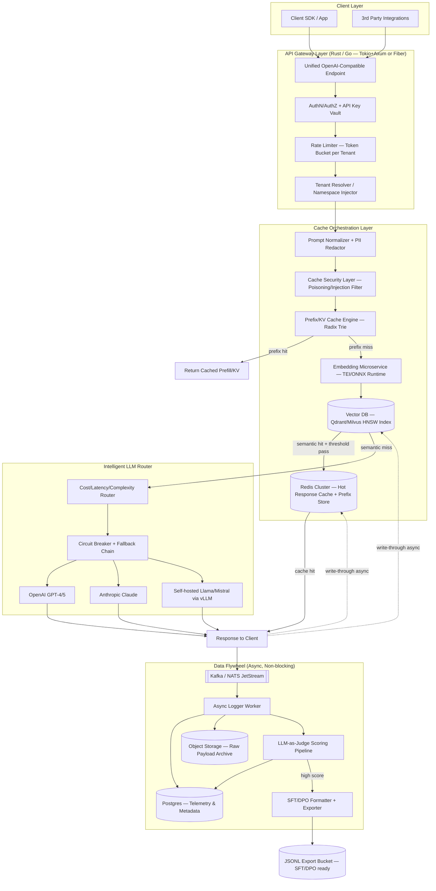
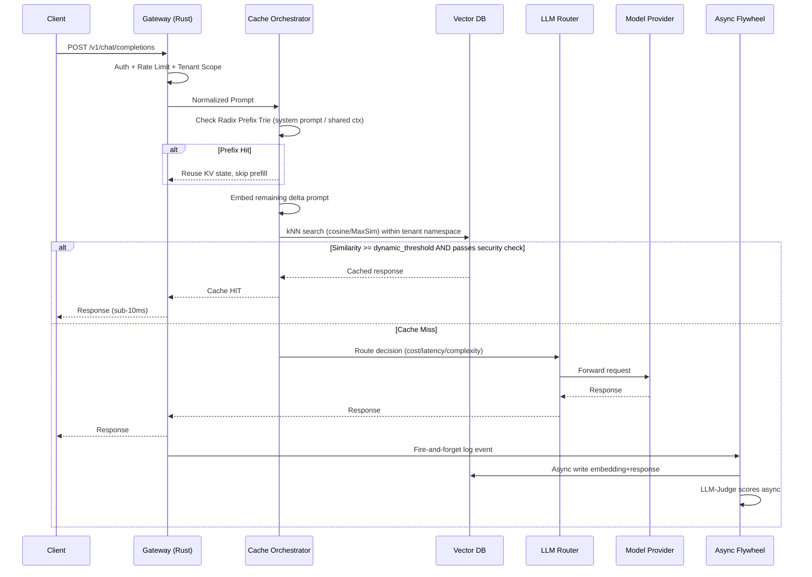

# Project "Cerberus" — Enterprise AI Middleware & Caching Platform
### Architecture Blueprint v1.0

---

## 1. System Architecture Diagram



## 2. Request Lifecycle (Sequence)



## 3. Multi-Tenant Cache Partitioning Model

```
Namespace Key = hash(tenant_id) + shard(model_family)
    Redis:   {tenant_id}:{model}:prefix:{trie_node_hash}
    Vector:  Qdrant collection-per-tier (shared infra, isolated payload filter tenant_id=X)
    Postgres: Row-level security (RLS) policy per tenant_id
```
Isolation strategy: **soft multi-tenancy** by default (shared HNSW index + mandatory `tenant_id` filter predicate pushed into the ANN search) for cost efficiency, with an option to promote high-tier/regulated tenants to **hard multi-tenancy** (dedicated Qdrant collection + dedicated Redis DB index) for compliance.

---

## 4. Tech Stack Recommendation (2026)

| Layer | Recommended Tech | Why |
|---|---|---|
| API Gateway | **Rust (Axum + Tokio)** | Sub-millisecond overhead, fearless concurrency, ideal for 50k+ RPS gateways. Go (Fiber/Gin) is the fallback if team velocity in Rust is a concern. |
| Embedding Service | **Python (FastAPI) + Hugging Face TEI (Text Embeddings Inference, Rust-backed)** or **ONNX Runtime** | TEI is Rust under the hood — serves BGE/E5/GTE small embedding models at very high throughput with dynamic batching. |
| Embedding Models | `bge-small-en-v1.5`, `e5-small-v2`, or `gte-modernbert` (2026-era) | Sub-100ms embedding latency, 384–768 dims, good enough recall for cache-matching (don't need SOTA retrieval quality here — need speed). |
| Vector DB | **Qdrant** (primary) — Rust-native, filterable payloads, HNSW+quantization | Milvus is a strong alt for >1B vector scale; RedisVL if you want to consolidate infra into one Redis cluster instead of a separate vector DB. |
| Prefix/KV Cache | **Redis Cluster** + custom Radix Trie service (Rust) mirroring vLLM's `RadixAttention` / SGLang's approach | Handles shared system-prompt prefix reuse; can sit alongside vLLM's own automatic prefix caching for a two-tier hit (network cache → GPU KV cache). |
| LLM Serving (self-hosted) | **vLLM** or **SGLang** with continuous batching + PagedAttention | Best throughput/cost for open models (Llama, Mistral, Qwen). |
| Message Queue | **NATS JetStream** (lighter, faster) or **Kafka** (if you need long retention + replay for fine-tune corpus) | Async decoupling of hot path from logging/judge pipeline. |
| Metadata DB | **PostgreSQL 16+** with `pgvector` optional for smaller deployments | ACID telemetry, RLS multi-tenancy, JSONB for flexible metadata. |
| Object Storage | **S3 / R2** | Raw payload archive, JSONL export bucket. |
| Judge Pipeline | Python async workers, small/cheap judge model (Claude Haiku 4.5 / GPT-5-mini) | Cost-efficient scoring at scale; batch requests. |
| Orchestration | **Kubernetes + KEDA** (autoscale on queue depth) | Elastic scaling of embedding/judge workers independent of gateway. |
| Observability | OpenTelemetry + Prometheus + Grafana + Jaeger | Full request tracing across cache/router/provider hops. |
| Service Mesh | Istio or Linkerd (mTLS) | Enterprise-grade tenant network isolation. |

**Rule of thumb:** Rust/Go own anything on the synchronous hot path (gateway, prefix trie, rate limiter). Python owns anything ML-heavy or async/offline (embeddings service behind TEI, judge pipeline, fine-tune export). Never put Python in the request's critical path if you can avoid it — use it as a sidecar/service the Rust gateway calls over gRPC.

---

## 5. Game-Changing Features (Beyond MVP — The "Beast" Feature Set)

These are the differentiators that would make this genuinely competitive with — not just imitative of — GPTCache/LiteLLM/Portkey and would give enterprises reasons to switch:

### A. Caching Intelligence
1. **Answer-Diffing / Delta Reuse** — When a query is 90% similar to a cached one but not identical, don't do a full regeneration. Send only the *delta* to a small model to patch the cached answer (edit-distance-aware regeneration), cutting token cost by 70-90% on near-duplicate queries instead of a binary hit/miss.
2. **Adaptive Threshold Tuning via Bandit Algorithm** — Instead of a static cosine threshold (e.g. 0.92), run a multi-armed bandit per tenant/domain that adjusts the threshold based on observed downstream quality signals (thumbs down, judge score, regeneration requests). Legal/medical tenants auto-tighten; casual chatbots auto-loosen.
3. **Conversation-Graph Caching** — Cache at the *conversation-node* level, not just single-turn prompts. Multi-turn chats get modeled as a DAG so a cache hit can occur mid-conversation, not only on turn 1.
4. **Predictive Pre-Warming** — Analyze traffic seasonality (e.g., "9am Monday standup bot queries") and pre-compute/pre-embed likely queries before they arrive, using idle GPU cycles.
5. **Cross-Tenant Federated Cache (opt-in, privacy-preserving)** — For non-sensitive, public-domain queries (e.g., "how do I center a div in CSS"), allow tenants to opt into a shared anonymized cache layer with differential-privacy-style aggregation, so common questions get instant answers platform-wide, not just per-tenant. This is a real cost lever the closed-source players can't easily offer.

### B. Security & Trust (the enterprise unlock)
6. **Cache Poisoning & Embedding Drift Detection** — Continuously monitor the embedding distribution of writes into the vector store; flag/quarantine anomalous clusters that could indicate adversarial cache-seeding attacks (someone deliberately inserting bad Q/A pairs to hijack future similar queries).
7. **Prompt-Injection-Aware Cache Gating** — Run a lightweight classifier *before* a cache write to detect if the "answer" being cached was actually the result of a hijacked/injected prompt, so you never immortalize a compromised response for future users.
8. **Explainable Cache Hits ("Why did I get this answer?")** — Every response carries a trace object: matched vector ID, similarity score, prefix hit depth, which router path was chosen. Critical for enterprise debugging/audit and for building trust with skeptical engineering teams.
9. **PII Redaction Pre-Cache** — Automatic entity detection/redaction before anything touches the vector store or logs, with tenant-configurable retention/redaction policies for compliance (GDPR/HIPAA/SOC2).

### C. Economics & Routing
10. **Real-Time GPU Spot-Price Arbitrage Routing** — Router doesn't just pick "cheapest model" statically — it watches real-time spot/on-demand pricing across inference providers (Together, Fireworks, Bedrock, self-hosted) and shifts traffic dynamically, like a financial trading engine for compute.
11. **Complexity-Aware Model Cascading** — A cheap classifier model scores each incoming prompt's difficulty; trivial queries go to a small/cheap model, hard ones cascade up to GPT-5/Claude Opus. Most gateways route on static rules — dynamic cascading based on live-scored complexity is a real differentiator.
12. **SLA-Aware Circuit Breaking** — Track p99 latency & error rate per provider in real time; auto-failover before a provider's degradation becomes visible to end users, with configurable per-tenant SLA tiers.

### D. The Data Flywheel (your real long-term moat)
13. **Self-Distilling Router** — The flywheel doesn't just export data for periodic fine-tuning — it continuously trains a small in-house model to absorb the "cascading" traffic pattern (item 11), so over time more and more traffic gets served by your own cheap fine-tuned model instead of paying big-LLM providers at all. This is the mechanism that actually beats the big AI companies economically: **you're building a cost curve that goes down over time while theirs stays flat.**
14. **Automated Regression/Eval Set Generation** — Every fine-tune cycle auto-generates a held-out eval set from flywheel data, so quality regressions are caught before a new fine-tuned model is promoted to production traffic.
15. **DPO Pair Mining from Cache Near-Misses** — When two semantically similar queries produced different-quality answers (per judge score), automatically mine them as a preference pair (chosen/rejected) for DPO — turning your cache's near-miss "waste" into free alignment data.

### E. Developer & Business Experience
16. **OpenAI-Compatible Drop-In + Multi-Language SDKs** — Zero-migration adoption: point existing OpenAI SDK `base_url` at your gateway and it works immediately in Python, TS, Go, Java.
17. **Live Cost/Latency Dashboard per Tenant/Team/Project** — Real dollars saved by cache hits, cost-per-request trend lines, anomaly alerts ("this team's spend spiked 40% today").
18. **Prompt Compression Layer (LLMLingua-style)** — Compress verbose prompts/context before they hit the cache or the LLM, reducing both token cost and improving cache-matching stability.
19. **Edge/WASM SDK** — A lightweight WASM build of the prefix/embedding-lookup client so latency-sensitive edge deployments (browser extensions, IoT, regional PoPs) can do a local cache check before even hitting your gateway.
20. **"Bring Your Own Model" Marketplace Mode** — Let enterprises register private fine-tuned models into the router as first-class citizens alongside GPT/Claude/Llama, so the platform becomes the control plane for *all* their inference, not just a proxy to public APIs.

**Strategic framing:** GPTCache and LiteLLM are point solutions (cache OR router). Portkey/Helicone are closer competitors but are largely observability + routing without a serious owned data flywheel. The wedge that actually threatens the big labs' economics isn't "cache hits save money today" — it's item 13: **every request your platform handles makes your own models smarter and cheaper, while every request through a raw API call teaches the incumbent nothing you own.** That compounding asset is the real moat.

---

## 6. Non-Functional Requirements Checklist
- **Throughput target:** Gateway layer 50k+ RPS on commodity hardware (Rust/Tokio easily hits this; Go is close second).
- **Cache hit latency:** < 15ms p99 (Redis) / < 40ms p99 (vector ANN search with quantized HNSW).
- **Availability:** 99.95% for gateway; router must degrade gracefully (never hard-fail — always fallback chain).
- **Data isolation:** Tenant-level RLS + mandatory payload filter on every vector query — no cross-tenant leakage even under shared-index mode.
- **Auditability:** Every request traceable end-to-end via OpenTelemetry span IDs correlated across gateway → cache → router → flywheel.
